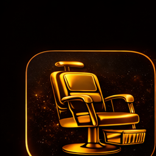
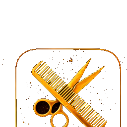
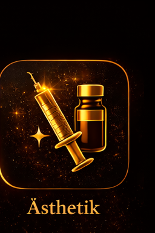
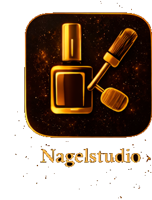
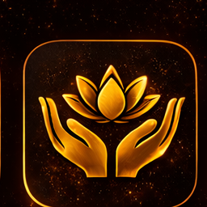
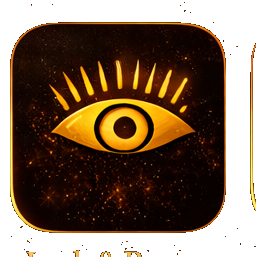
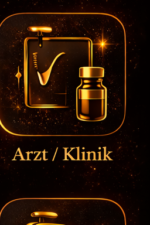
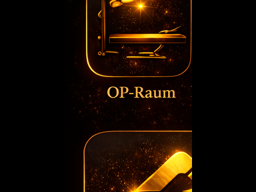
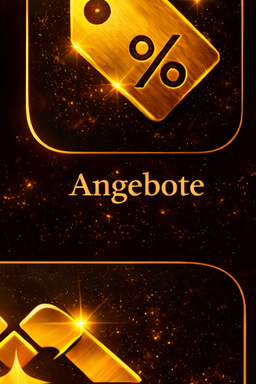
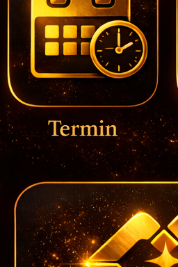

# CLAUDE.md — ChairMatch Proje Kuralları

## Deployment
- Her push sonrası Vercel preview otomatik oluşur — kullanıcıdan onay isteme
- Push → PR → Merge akışını mümkünse otomatik yap

## Stil
- Seçenekli sorularda her zaman kısa artı/eksi tablosu göster
- Türkçe iletişim (kullanıcı tercih etti)

## Teknik
- Proje: Tek dosya vanilla JS SPA (index.html)
- Deploy: Vercel (otomatik, main branch)
- CSS: Custom properties ile responsive (--pad, --font-xs/sm/md/lg/xl, --shell-max)
- SSH key kurulu, HTTPS token değil

---

## ‼️ ACİL GÖREV — V2 ICONS UYGULAMASI ‼️

AŞAĞIDAKI TÜM DEĞİŞİKLİKLERİ index.html'DE YAP, SONRA git push origin main YAP.

icons/ klasöründe V2 PNG dosyaları zaten mevcut. Onlara dokunma, 1:1 kullan.

### ADIM 1: CSS (<style> bloğunda)

Şu keyframes'leri ekle (yoksa):
```css
@keyframes logoFloat{0%,100%{transform:translateY(0px)}50%{transform:translateY(-4px)}}
@keyframes logoGlow{0%,100%{filter:drop-shadow(0 0 10px rgba(200,168,75,0.5)) drop-shadow(0 0 25px rgba(200,168,75,0.15))}50%{filter:drop-shadow(0 0 20px rgba(232,208,106,0.8)) drop-shadow(0 0 40px rgba(200,168,75,0.3))}}
```

.catcard .caticon CSS'i tamamen değiştir:
```css
.catcard .caticon{width:100%;height:140px;border-radius:16px;background:transparent;display:flex;align-items:center;justify-content:center}
.catcard .caticon img{width:100%;height:100%;object-fit:contain;object-position:center;filter:drop-shadow(0 0 12px rgba(200,168,75,0.5)) drop-shadow(0 0 30px rgba(200,168,75,0.15));border-radius:12px}
```

Responsive:
```css
@media(max-width:374px){.catcard{padding:10px 6px 10px;border-radius:13px}.catcard .caticon{height:100px}.catcard .catlbl{font-size:11px;margin-top:7px}.catcard .catsub{font-size:8px}}
```

### ADIM 2: catIcons (renderHome() fonksiyonunda)

catIcons değişkenini bununla değiştir:
```javascript
const catIcons={barber:'',friseur:'',kosmetik:'',aesthetik:'',nail:'',massage:'',lash:'',arzt:'',opraum:'',angebote:'',termin:''};
```

### ADIM 3: logoHeader() fonksiyonunu tamamen değiştir

```javascript
function logoHeader(small){
  if(small) return `<div style="display:flex;align-items:center;gap:10px;min-width:0;flex-shrink:1">
    <div style="animation:logoFloat 3s ease-in-out infinite,logoGlow 3s ease-in-out infinite;display:inline-block;flex-shrink:0">
      
    </div>
    <div style="min-width:0">
      <p class="cinzel" style="font-size:15px;font-weight:700;letter-spacing:2px;color:var(--gold2);line-height:1;white-space:nowrap;overflow:hidden;text-overflow:ellipsis">CHAIR<span style="color:var(--gold3)">MATCH</span></p>
      <p style="font-size:8px;letter-spacing:3px;color:var(--stone);margin-top:2px">DEUTSCHLAND</p>
    </div>
  </div>`;
  return `<div style="display:flex;flex-direction:column;align-items:center;padding:16px 0 10px">
    <div style="animation:logoFloat 3s ease-in-out infinite,logoGlow 3s ease-in-out infinite;display:inline-block">
      
    </div>
  </div>`;}
```

### ADIM 4: rentalIcon() fonksiyonunu değiştir

Tüm SVG kodunu sil, bununla değiştir:
```javascript
function rentalIcon(type){
  const iconMap={stuhl:"icons/12_stuhlvermietung_512x384.png",liege:"icons/06_massage_256x384.png",raum:"icons/03_kosmetik_256x384.png",opraum:"icons/09_op_raum_512x384.png"};
  const src=iconMap[type];
  if(src) return ``;
  return "";
}
```

### ADIM 5: Onboarding'de dbSeat() değiştir

BUL:
```javascript
sl.icon==="chair"?`<div style="margin-bottom:14px;display:flex;gap:4px;align-items:flex-end;justify-content:center;filter:drop-shadow(0 0 12px rgba(200,168,75,.4))"><div>${dbSeat()}</div></div>`
```

DEĞİŞTİR:
```javascript
sl.icon==="chair"?`<div style="margin-bottom:14px;display:flex;align-items:center;justify-content:center;animation:logoFloat 3s ease-in-out infinite,logoGlow 3s ease-in-out infinite"></div>`
```

### YASAK KURALLAR
- .caticon üzerinde overflow:hidden YASAK
- object-fit:cover YASAK (SADECE contain)
- Icons üzerinde transform:scale() YASAK
- .caticon üzerinde background-gradient YASAK (SADECE transparent)
- catSVG() ve dbSeat() fonksiyonlarını SİLME (fallback olarak kalabilir)

### BİTİRDİKTEN SONRA
```bash
git add -A && git commit -m "V2 Icons komplett implementiert" && git push origin main
```
